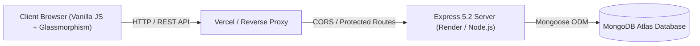

# ⚡ Webify — Production Risk & Inventory Intelligence System

A high-performance, enterprise-grade inventory management and material planning platform designed to monitor production risk, track cost variances in real-time, and automate procurement replenishment alerts.

[](https://nodejs.org)
[](https://expressjs.com)
[](https://mongodb.com)
[](LICENSE)
[](#deployment)

---

## 🌟 Architecture & Highlights

Webify combines production planning arithmetic with real-time operational stock tracking:



- **Clean Monolithic or Decoupled Architecture**: Can run as a unified Express application serving static assets from `public/`, or decoupled with frontend on **Vercel** and backend on **Render**.
- **Dark Glassmorphism UI**: High-end obsidian aesthetic with 3D depth tilt, subtle gradients, animated KPI rollups, and responsive mobile drawers.
- **Enterprise Security**: Bcrypt password hashing, JWT stateless authentication (7-day validity), IP rate limiting, and CORS whitelist protection.
- **Real-Time Intelligence**: Live calculation preview in forms, dynamic inventory search, risk filtering, and CSV export.

---

## 🚀 Core Modules & Capabilities

### 1. 📊 Executive Dashboard
- **Live Financial & Risk KPIs**:
  - **Planned Production Cost**: Budget allocated across all items.
  - **Actual Consumption Spend**: Real expenditure calculated dynamically.
  - **Cost Variance**: Immediate detection of budget overruns ($\text{Actual} - \text{Planned}$).
  - **Critical Risk Items**: Real-time count of materials below safe operating levels.
- **Recent Inventory Table**: Live search and instant status tagging.
- **CSV Data Export**: One-click download of the complete inventory roster with timestamps.

### 2. 🧮 Automated Production & Risk Formulas
All calculations are performed automatically upon item creation and modification:
$$\text{Planned Amount} = \text{Planned Quantity} \times \text{Planned Rate}$$
$$\text{Actual Amount} = \text{Actual Quantity} \times \text{Actual Rate}$$
$$\text{Variance} = \text{Actual Amount} - \text{Planned Amount}$$
$$\text{Reorder Level} = (\text{Daily Consumption} \times \text{Lead Time}) + \text{Safety Stock}$$
$$\text{Reorder Quantity} = \max(0, \text{Reorder Level} - \text{Current Stock})$$
$$\text{Risk Score (\%)} = \min\left(100, \max\left(0, \frac{\text{Reorder Level} - \text{Current Stock}}{\text{Reorder Level}} \times 100\right)\right)$$

**Risk Categorization**:
- 🔴 **Critical** ($\text{Risk Score} > 70\%$): Immediate stockout danger; production shutdown imminent.
- 🟡 **Warning** ($40\% \le \text{Risk Score} \le 70\%$): Stock approaching reorder threshold.
- 🟢 **Safe** ($\text{Risk Score} < 40\%$): Healthy inventory buffer.

### 3. ➕ Product Planning & Live Preview
- Grouped input fields for **Item Identification**, **Planning Target**, **Actual Consumption**, and **Stock Controls**.
- **Real-Time Calculation Card**: Shows planned amount, actual amount, cost variance, reorder level, and calculated risk tier *as the user types*.

### 4. 📋 Master Inventory Grid
- Real-time client-side search across item names, SKUs, and categories.
- Risk level filtering dropdown (All, Critical, Warning, Safe).
- In-place modal editing with automatic recalculations.
- Custom styled deletion modal eliminating blocking browser prompts.

### 5. 📈 Cost & Health Analytics
- **Bar Chart**: Comparative visualization of Planned vs. Actual Cost per product using Chart.js.
- **Doughnut Chart**: Proportion of Critical vs. Warning vs. Safe products.
- Fully responsive dark-mode tooltips with INR currency formatting.

### 6. 🚨 Procurement & Reorder Alerts
- Prioritized alert cards displaying suggested order quantities and lead-time reminders.
- Replenishment summary roster.

---

## 🛠️ Tech Stack

- **Backend**: Node.js, Express.js 5.2, Mongoose 9.2, JWT (`jsonwebtoken`), `bcryptjs`, `express-rate-limit`, `cors`, `dotenv`
- **Frontend**: Vanilla ES6+ JavaScript, Bootstrap 5.3, Chart.js, Custom Glassmorphism CSS Design System
- **Database**: MongoDB (Atlas or local)

---

## 📡 API Reference

### Health & System
| Method | Endpoint | Access | Description |
|---|---|---|---|
| `GET` | `/health` | Public | Service health & uptime status |
| `GET` | `/api/health` | Public | Redundant health check for API routers |
| `GET` | `/api` | Public | API metadata and endpoint directory |

### Authentication
| Method | Endpoint | Access | Body Parameters |
|---|---|---|---|
| `POST` | `/api/signup` | Public | `name`, `email`, `password` (min 6 chars) |
| `POST` | `/api/login` | Public | `email`, `password` |
| `GET` | `/api/user/:id` | Protected | Returns authenticated user profile |

### Inventory & Products
| Method | Endpoint | Access | Query / Body Parameters |
|---|---|---|---|
| `GET` | `/api/products` | Protected | Query: `search`, `riskCategory`, `sortBy`, `page`, `limit` |
| `POST` | `/api/products` | Protected | Body: `itemName`, `plannedQty`, `plannedRate`, `actualQty`, `actualRate`, `currentStock`, `dailyConsumption`, `leadTime`, `safetyStock`, `category`, `sku` |
| `PUT` | `/api/products/:id` | Protected | Updates product fields and recalculates risk/variance |
| `DELETE` | `/api/products/:id` | Protected | Deletes product by ID |

### Dashboard & Analytics
| Method | Endpoint | Access | Description |
|---|---|---|---|
| `GET` | `/api/summary` | Protected | Aggregated totals for planned, actual, variance, and critical items |
| `GET` | `/api/dashboard` | Protected | Summary metrics plus 10 recent products |

---

## ⚙️ Local Development Setup

### 1. Prerequisites
- Node.js `v18.0.0` or higher
- MongoDB instance (MongoDB Atlas cluster or local MongoDB)

### 2. Clone and Install
```bash
git clone https://github.com/PrajithVellingiri/webify.git
cd webify
npm install
```

### 3. Configure Environment Variables
Copy `.env.example` to `.env`:
```bash
cp .env.example .env
```
Populate `.env`:
```env
MONGODB_URI=mongodb+srv://<username>:<password>@cluster0.mongodb.net/webify?retryWrites=true&w=majority
JWT_SECRET=super_secret_jwt_key_at_least_32_characters_long
PORT=5000
NODE_ENV=development
```

### 4. Run the Application
```bash
# Start development server with live reload
npm run dev

# Or start standard production server
npm start
```

Visit `http://localhost:5000` in your browser. The application will automatically route to `/login.html`.

---

## 🚀 Production Deployment

### Option A: Unified Deployment on Render (Recommended)
Because Webify's Express server serves both the REST API and the static assets in `public/`, deploying to Render as a single Web Service is the most straightforward method:

1. Create a new **Web Service** on [Render](https://render.com).
2. Connect your GitHub repository.
3. Configure the settings:
   - **Environment**: `Node`
   - **Build Command**: `npm install`
   - **Start Command**: `npm start`
4. Under **Environment Variables**, add:
   - `MONGODB_URI`: Your MongoDB Atlas connection URI.
   - `JWT_SECRET`: A secure random secret string.
   - `NODE_ENV`: `production`
5. Render automatically sets `PORT` and routes HTTP traffic to `0.0.0.0`.
6. Health Check Path: `/health`.

### Option B: Decoupled Frontend (Vercel) + Backend (Render)
If you prefer hosting the frontend on Vercel:
1. **Backend on Render**: Deploy the backend following Option A. Set `FRONTEND_URL=https://your-project.vercel.app`.
2. **Frontend on Vercel**:
   - Deploy repository to [Vercel](https://vercel.com).
   - `vercel.json` is pre-configured to route API requests directly to the Render backend and serve static files from `public/`.
   - Update `destination` in `vercel.json` with your active Render backend URL.

---

## 🛡️ Security Audit Summary

- ✅ **No plaintext passwords**: All passwords hashed using `bcrypt` (salt factor 10).
- ✅ **Stateless authorization**: Requests validated via signed Bearer JWTs.
- ✅ **Rate limiting**: API protected against brute-force and scraping via `express-rate-limit`.
- ✅ **No hardcoded secrets**: All database URIs and keys loaded via environment variables.
- ✅ **Sanitized error messages**: Internal stack traces suppressed in production responses.
- ✅ **0.0.0.0 binding**: Cloud container network routing fully supported.

---

## 📄 License
This project is licensed under the MIT License.
